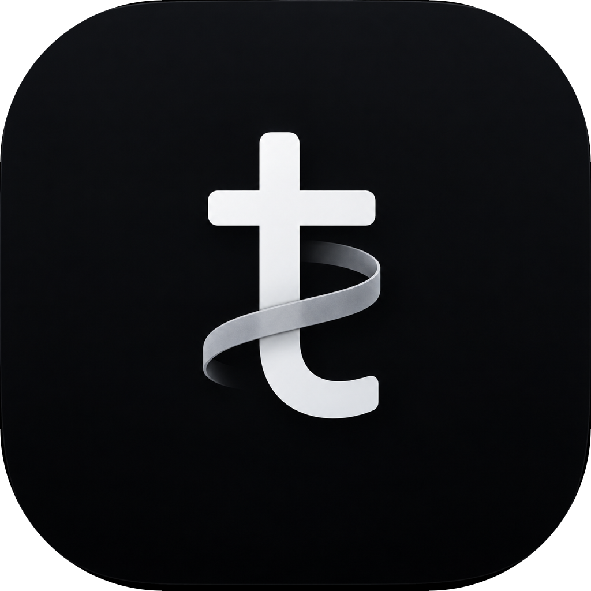

<p align="center">
  
</p>

<h1 align="center">Thread</h1>

<p align="center">A local desktop client for coding agents — Claude and OpenAI Codex — in one chat UI.</p>

Pick a project folder, open a thread, and pair with the agent: streaming responses,
live tool calls and reasoning, tool-use approvals, Plan/Build modes, and a per-turn
git diff viewer. Runs locally — no cloud backend, no accounts.

Built on Electron + a local event-sourced server + a WebSocket RPC, driving the
Claude Agent SDK and the OpenAI/Codex agents.

## Run

```bash
pnpm install
pnpm run dev
```

The selected model in the composer picks the provider for that turn.

## Features

- **Streaming chat** — token-level output, thinking blocks, and tool/file-edit
  activity shown live as work items
- **Approvals** — the agent pauses for permission (Approve / Always allow / Decline);
  modes: Supervised, Auto-accept edits, Full access
- **Plan mode** — read-only planning (Shift+Tab to toggle)
- **Diffs** — per-turn git checkpoints and a working-tree diff panel (inline/split),
  without touching your real index
- **Model picker** — Claude and Codex models, with per-model reasoning effort
- **Multi-turn sessions** — session resume per thread; auto-generated thread titles

The renderer never touches Node/OS directly (`contextIsolation: true`); everything
flows over the WS RPC, with a minimal preload bridge for dialogs and links.

## Scripts

```bash
pnpm run dev        # Vite dev server + Electron with HMR
pnpm run build      # bundle main / preload / renderer into out/
pnpm run start      # preview the production build
pnpm run typecheck  # tsc over both tsconfigs
pnpm run lint       # eslint
```
